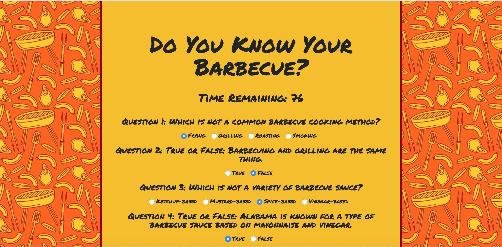
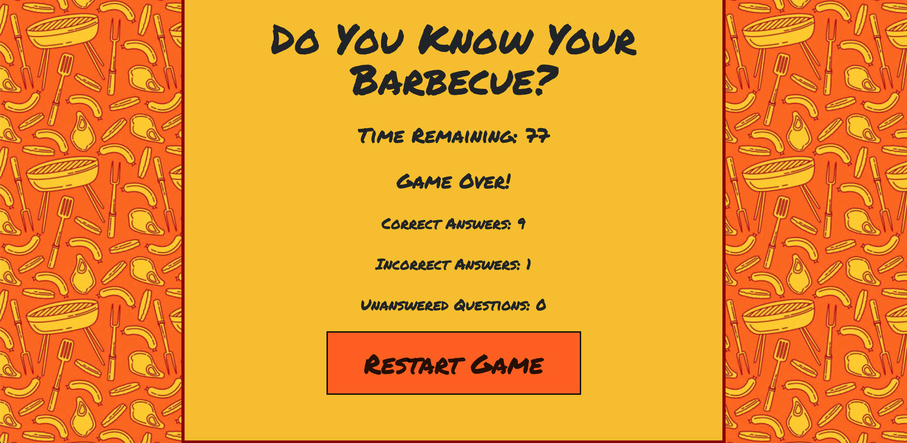

# TriviaGame

Barbecue is an iconic food in cultures all over the world, including America. Test your knowledge of American barbecue in this timed trivia game made using HTML, CSS, JavaScript, and jQuery.

Visit the project at https://lynnamsbury.github.io/TriviaGame/

## Specs:

The quiz form has multiple choice and true/false options, and the player may not pick more than one answer per question.

The player has a limited amount of time to finish the quiz.

The game ends when the time runs out. The end page reveals the number of questions that the player answer correctly and incorrectly.

